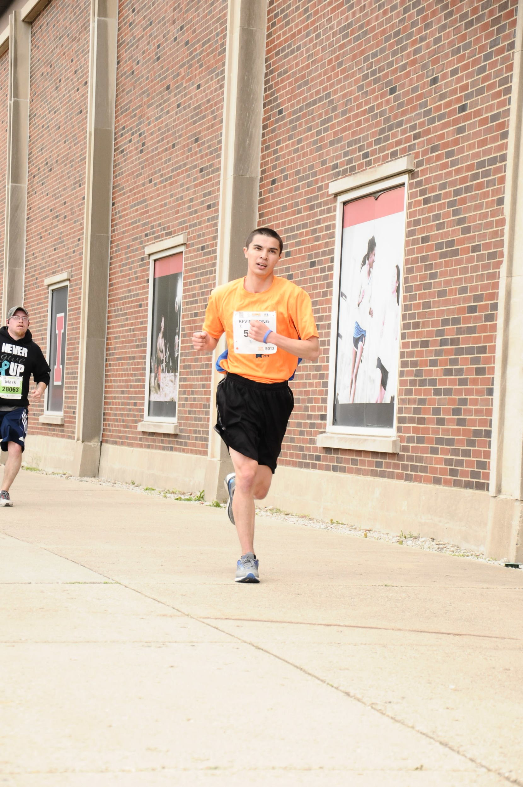

<style>
body {
  background-color: #FF8200;
}
</style>

```{r echo = FALSE, eval = FALSE}
Add 12 month difference green if higher red if lower
Add Year to Year difference

Add miles needed to beat last year/last month

Add run intensity.

Fuseball example. Rankings system. Win Loss ranking. ID number for each person. If Kevin who is 3-0 beats Bob who is 1-2, computer projects score to be Kevin 10 - Bob 3.7. If Kevin wins, his win/loss ranking goes up. Bobs goes down. However, if Kevin wins 10-8, Kevin''s win/loss ranking goes up but his ELO scoring goes down.

Making new table into aggregate table like Compass Mortgage grouped by day. Continue to use miles per hour formula to calculate pace. But need to use group by a little bit more.

2-1-2020: Actually don't use group by. Use table as is but use indicator "flags" and sum those
```


```{r echo = FALSE, warning = FALSE, message = FALSE}
library(lubridate)
library(knitr)
library(kableExtra)
library(tidyverse)
library(stringr)
library(ggplot2)
Start_Date = as.Date("1/28/2018", format = "%m/%d/%Y")
```

```{r echo = FALSE}
Update_Date = as.Date("1/1/2020", format = "%m/%d/%Y")

 # read_data = read.csv(file = "~/Documents/Kevin Stuff/Not Work/website/Website Files/more website files/Running_10_12_2019.csv", skip = 1)

read_data = read.csv(file = "~/Documents/Kevin Stuff/Not Work/website/Website Files/more website files/Book4.csv", skip = 1)
```

***

```{r echo = FALSE}
running = read_data %>%
  select(Location,
         Day,
         Month,
         Day.1,
         Date,
         Run.Calories,
         Run.Distance,
         Run.Minutes,
         Run.Seconds,
         Walk.Calories,
         Walk.Distance,
         Walk.Minutes,
         Walk.Seconds,
         Start.Time) %>%
  # slice(1:(Update_Date - Start_Date - 1) %>% as.integer())
  slice(1:713 %>% as.integer())

names(running) = c("Location", "Weekday_Read", "Month_Number_Read", "Day Number", "Date", "Run Calories", "Run Distance", "Run Minutes", "Run Seconds", "Walk Calories", "Walk Distance", "Walk Minutes", "Walk Seconds", "StartTime")

running$Date         = running$Date            %>% as.Date(format = "%m/%d/%y")
running$DayNumber    = running$`Day Number`    %>% as.character() %>% as.integer()
running$RunCalories  = running$`Run Calories`  %>% as.character() %>% as.integer()
running$RunDistance  = running$`Run Distance`  %>% as.character() %>% as.numeric()
running$RunMinutes   = running$`Run Minutes`   %>% as.character() %>% as.integer()
running$RunSeconds   = running$`Run Seconds`   %>% as.character() %>% as.integer()
running$WalkCalories = running$`Walk Calories` %>% as.character() %>% as.integer()
running$WalkDistance = running$`Walk Distance` %>% as.character() %>% as.numeric()
running$WalkMinutes  = running$`Walk Minutes`  %>% as.character() %>% as.integer()
running$WalkSeconds  = running$`Walk Seconds`  %>% as.character() %>% as.integer()

running = running %>%
  select(Location,
         Weekday_Read,
         Month_Number_Read,
         Date,
         StartTime,
         DayNumber,
         RunCalories,
         RunDistance,
         RunMinutes,
         RunSeconds,
         WalkCalories,
         WalkDistance,
         WalkMinutes,
         WalkSeconds)

running$Month = factor(running$Month_Number_Read)
levels(running$Month) = c(month.name, "Total")

running$Year = running$Date %>%
  format(format = "%Y") %>%
  factor(levels = running$Date %>%
           format(format = "%Y") %>%
           unique() %>%
           sort()
         )

running$Weekday = factor(x = running$Weekday_Read,
                         levels = c("Monday", "Tuesday", "Wednesday", "Thursday", "Friday", "Saturday", "Sunday", "Total"))

running$YearMonth = paste(running$Month, " ", running$Year, sep = "") %>% factor(levels = paste(month.name, rep(running$Year %>% levels(), each = length(month.name)))[1:(Update_Date %>% format(format = "%m") %>% as.integer() %>% "+"(1) - Start_Date %>% format(format = "%m") %>% as.integer() + (Update_Date %>% format(format = "%y") %>% as.integer() - Start_Date %>% format(format = "%y") %>% as.integer()) %>% "*"(12))])

running = select(running, - Weekday_Read, - Month_Number_Read)

running$Treadmill = ifelse(running$Location == "Arc" | running$Location == "Ike" | running$Location == "CRCE" | running$Location == "Lifetime Fitness" | running$Location == "Lifetime", 1, 0)
running$CumRunDistance = cumsum(running$RunDistance)

running$run_Count = ifelse(running$RunDistance > 0, 1, 0)

# running$unique_run_count = ifelse(running$RunDistance == running %>% group_by(Date) %>% mutate(max(RunDistance)), 1, 0)
```

```{r echo = FALSE}
# 2 - 1 - 2020: There has to be a better way to do this but it's whatever. this will do
running = running %>% group_by(Date) %>% mutate(y = max(RunDistance))

running$unique_run_count = ifelse(running$RunDistance == running$y & running$y != 0, 1, 0)
```


```{r echo = FALSE}
pace_calculator = function(distance, minutes, seconds) {
  m = ((minutes * 60 + seconds) / distance) %>% ceiling() %>% "%/%"(60)
  s = ((minutes * 60 + seconds) / distance) %>% ceiling() %>% "%%"(60)
  pace = paste(m %>% as.numeric() %>% as.character(),
               ":",
               s %>% paste(":01 ", today(), sep = "") %>% as.POSIXct(format = "%M:%S %Y-%m-%d") %>% str_sub(start = 15, end = 16),
               sep = "")
  return(pace)
}

yearly_mileage_pace = function(distance) {
  l = (distance / n()) %>% "*"(365) %>% "*"(100) %>% floor() %>% "/"(100)
  return(l)
}

total_time = function(minutes, seconds) {
  h = (minutes * 60 + seconds) %>% sum() %>% "%/%"(60) %>% "%/%"(60)
  m = (minutes * 60 + seconds) %>% sum() %>% "%/%"(60) %>% "%%"(60) %>% paste(":01 ", today(), sep = "") %>% as.POSIXct(format = "%M:%S %Y-%m-%d") %>% str_sub(start = 15, end = 16)
  s = (minutes * 60 + seconds) %>% sum() %>% "%%"(60) %>% paste(":01 ", today(), sep = "") %>% as.POSIXct(format = "%M:%S %Y-%m-%d") %>% str_sub(start = 15, end = 16)
  t = paste(h, ":", m, ":", s, sep = "")
  return(t)
}

miles_per_run = function(distance) {
  t = (distance %>% sum() / (distance > 0) %>% sum()) %>% "*"(100) %>% floor() %>% "/"(100)
  return(t)
}

miles_per_day = function(distance) {
  t = (distance %>% sum() / (n())) %>% "*"(100) %>% floor() %>% "/"(100)
  return(t)
}

miles_per_hour = function(distance, minutes, seconds) {
  t = (distance %>% sum() * 60 * 60 / (minutes * 60 + seconds)) %>% "*"(1000) %>% floor() %>% "/"(1000)
  return(t)
}
```


```{r echo = FALSE}
total_row = c("Total",
              sum(running$RunDistance > 0),
              sum(running$RunDistance),
              "ok",
              "pace")
```

<script>
function myFunction1() {
  var x = document.getElementById("myDIV1");
  if (x.style.display === "block") {
    x.style.display = "none";
  } else {
    x.style.display = "block";
  }
}

function myFunction2() {
  var x = document.getElementById("myDIV2");
  if (x.style.display === "block") {
    x.style.display = "none";
  } else {
    x.style.display = "block";
  }
}

function myFunction3() {
  var x = document.getElementById("myDIV3");
  if (x.style.display === "block") {
    x.style.display = "none";
  } else {
    x.style.display = "block";
  }
}
</script>

<style type="text/css">

td, tr {
   font-family: "Times New Roman";
   font-size: 20px;
}

body, p {
   font-family: "Times New Roman";
   font-size: 18px;
}

</style>

<h1>Kevin's Running Data</h1>

Last updated: `r paste(format(x = Update_Date, format = "%B"), " ", format(x = Update_Date, format = "%d") %>% as.numeric(), ", ", format(x = Update_Date, format = "%Y") %>% as.numeric(), sep = "")`

***

I enjoy running in my freetime! I have been tracking my jogging stats since January 31, 2018. Over the past `r Update_Date - Start_Date - 1` days, I have jogged `r sum(running$RunDistance)` miles across `r sum(running$RunDistance > 0)` different runs.

```{r out.height = "150px", out.width = "200px", fig.align = "center", echo = FALSE}

```

This is me during the 2019 Illinois Half Marathon! I ran 13.1 miles in 1:43:29.

```{r echo = FALSE, eval = FALSE}
HM = c("Illinois Half Marathon",
          "Distance",
          "April 27, 2019",
          "1:43:29",
          "7:54",
          "364/3098",
          "275/1430",
          "36/193")
names(HM) = c("Event", "13.1 Miles", "Date", "Time", "Pace", "Rank", "Rank (Males)", "Rank (Males 20-24)")
HM = as.data.frame(HM)
kable(x = HM, format = "html", align = "lrrrrrrrrrrrrrr") %>%
  kable_styling(bootstrap_options = c("hover", "responsive")) %>%
  scroll_box(width = "100%", height = "100%")
```


*** 

# Yearly Stats

```{r echo = FALSE, warning = FALSE}
options(dplyr.summarise.inform = FALSE)

groupby_year = running %>%
  group_by(Year) %>%
  summarise(Total_Runs = sum(RunDistance > 0),
            
            Total_Days_Runs = sum(unique_run_count),
            
            Distance = sum(RunDistance),
            
            Time = total_time(
              minutes = RunMinutes %>% sum(),
              seconds = RunSeconds %>% sum()
            ),
            
            Pace = pace_calculator(
              distance = RunDistance %>% sum(),
              minutes = RunMinutes %>% sum(),
              seconds = RunSeconds %>% sum()
            )
            )

# groupby_year = rbind(groupby_year, total_row)

names(groupby_year) = c("Year", "Total Runs", "Total Run Days", "Miles", "Time", "Pace")

groupby_year = groupby_year[order(groupby_year$Year), ]

kable(groupby_year, format = "html", align = "lrrrr") %>%
  kable_styling(bootstrap_options = c("hover", "responsive"))# %>%
  #row_spec(row = nrow(groupby_year), bold = TRUE, font_size = 21)
```

```{r echo = FALSE}
ggplot(data = groupby_year, aes(x = Year, y = Miles)) +
  geom_bar(stat = "identity", fill = "darkblue") +
  geom_text(aes(label = Miles %>% round(digits = 2) %>% format(nsmall = 2)), vjust = 1.6, color = "white", size = 5) +
  xlab(label = "Year") +
  ylab(label = "Miles") +
  ggtitle(label = "Miles by Year") +
  theme(plot.title = element_text(hjust = 0.5))
```

<button onclick="myFunction1()" type="button" class="btn btn-primary" data-toggle="collapse" data-target="#demo"> Click to Show Advanced Yearly Stats </button>

<div id="myDIV1" class="collapse">  

<br />

<h3>Advanced Yearly Stats</h3>

```{r echo = FALSE}
groupby_year = running %>%
  group_by(Year) %>%
  summarise(Total_Runs = sum(RunDistance > 0),
            
            Total_Days_Runs = sum(unique_run_count),
            
            Days_Off = sum(RunDistance == 0),
            
            Distance = sum(RunDistance),
            
            Time = total_time(
              minutes = RunMinutes %>% sum(),
              seconds = RunSeconds %>% sum()
            ),
            
            Pace = pace_calculator(
              distance = RunDistance %>% sum(),
              minutes = RunMinutes %>% sum(),
              seconds = RunSeconds %>% sum()
            ),
            
            Miles_Per_Run = miles_per_run(
              distance = RunDistance
            ),
            
            Miles_Per_Day = miles_per_day(
              distance = RunDistance %>% sum()
            ),
            
            Yearly_Mileage_Rate = yearly_mileage_pace(
              distance = RunDistance %>% sum()
            ),

            MPH = miles_per_hour(
              distance = RunDistance %>% sum(),
              minutes = RunMinutes %>% sum(),
              seconds = RunSeconds %>% sum()
            ),
            
            Calories = sum(RunCalories)
            )

names(groupby_year) = c("Year", "Total Runs", "Total Run Days", "Days Off", "Miles", "Time", "Pace", "Miles Per Run", "Miles Per Day", "Yearly Mile Rate", "MPH", "Total Calories Burned")

kable(x = groupby_year, format = "html", align = "lrrrrrrrrrrrrrr") %>%
  kable_styling(bootstrap_options = c("hover", "responsive")) %>%
  scroll_box(width = "100%", height = "100%")
```

</div>


***

# Monthly Stats

```{r echo = FALSE}
groupby_yearmonth = running %>%
  group_by(YearMonth) %>%
  summarise(Total_Runs = sum(run_Count),
            
            Total_Days_Runs = sum(unique_run_count),
            
            Distance = sum(RunDistance),
            
            Time = total_time(
              minutes = RunMinutes %>% sum(),
              seconds = RunSeconds %>% sum()
            ),
            
            Pace = pace_calculator(
              distance = RunDistance %>% sum(),
              minutes = RunMinutes %>% sum(),
              seconds = RunSeconds %>% sum()
            )
  )

# groupby_yearmonth$yearmonth = paste(groupby_yearmonth$Month, groupby_yearmonth$Year, sep = " ")
# groupby_yearmonth = select(as.data.frame(select(groupby_yearmonth, - Month)), - Year)
# groupby_yearmonth = groupby_yearmonth[, c(ncol(groupby_yearmonth), 1:ncol(groupby_yearmonth) - 1)]
# 
# groupby_yearmonth = rbind(groupby_yearmonth, total_row)

names(groupby_yearmonth) = c("Month", "Total Runs", "Total Run Days", "Miles", "Time", "Pace")

kable(groupby_yearmonth, format = "html", align = "lrrrr") %>%
  kable_styling(bootstrap_options = c("hover", "responsive")) #%>%
  #row_spec(row = nrow(groupby_yearmonth), bold = TRUE, font_size = 21)
```

```{r echo = FALSE, eval = FALSE}

ggplot(data = groupby_yearmonth, aes(x = Month, y = Miles %>% as.numeric())) +
  geom_bar(stat = "identity", fill = "darkblue") +
  geom_text(aes(label = Miles %>% round(digits = 2) %>% format(nsmall = 2)), vjust = 1.6, color = "white", size = 2) +
  ggtitle("Month vs. Miles") +
  theme(plot.title = element_text(hjust = 0.5))
```

<button onclick="myFunction2()" type="button" class="btn btn-primary" data-toggle="collapse" data-target="#demo"> Click to Show Advanced Monthly Stats </button>

<div id="myDIV2" class="collapse">  

<br />

<h3>Advanced Monthly Stats</h3>

```{r echo = FALSE}
groupby_yearmonth = running %>%
  group_by(YearMonth) %>%
  summarise(Total_Runs = sum(run_Count),
            
            Total_Days_Runs = sum(unique_run_count),
            
            Days_Off = sum(RunDistance == 0),
            
            Distance = sum(RunDistance),
            
            Time = total_time(
              minutes = RunMinutes %>% sum(),
              seconds = RunSeconds %>% sum()
            ),
            
            Pace = pace_calculator(
              distance = RunDistance %>% sum(),
              minutes = RunMinutes %>% sum(),
              seconds = RunSeconds %>% sum()
            ),
            
            Miles_Per_Run = miles_per_run(
              distance = RunDistance
            ),
            
            Miles_Per_Day = miles_per_day(
              distance = RunDistance %>% sum()
            ),
            
            Yearly_Mileage_Rate = yearly_mileage_pace(
              distance = RunDistance %>% sum()
            ),

            MPH = miles_per_hour(
                distance = RunDistance %>% sum(),
                minutes = RunMinutes %>% sum(),
                seconds = RunSeconds %>% sum()
            ),
            
            Calories = sum(RunCalories)
            )

names(groupby_yearmonth) = c("Month", "Total Runs", "Total Run Days", "Days Off", "Miles", "Time", "Pace", "Miles Per Run", "Miles Per Day", "Yearly Mile Rate", "MPH", "Total Calories Burned")

kable(x = groupby_yearmonth, format = "html", align = "lrrrrrrrrrrrrrr") %>%
  kable_styling(bootstrap_options = c("hover", "responsive")) %>%
  scroll_box(width = "100%", height = "100%")
```

</div>

***

# Weekday Stats

```{r echo = FALSE}
groupby_weekday = running %>%
  group_by(Weekday) %>%
  summarise(Total_Runs = sum(run_Count),
            
            Total_Days_Runs = sum(unique_run_count),
            
            Distance = sum(RunDistance),
            
            Time = total_time(
              minutes = RunMinutes %>% sum(),
              seconds = RunSeconds %>% sum()
            ),
            
            Pace = pace_calculator(
              distance = RunDistance %>% sum(),
              minutes = RunMinutes %>% sum(),
              seconds = RunSeconds %>% sum()
            )
  )
            
            # Miles_Per_Run = floor(sum(RunDistance) * 100 / sum(RunDistance > 0)) / 100,
            
            #MPH = floor(sum(RunDistance) / (((((sum(RunMinutes) + sum(RunSeconds) %/% 60) %/% 60) * 60 * 60 + ((sum(RunMinutes) + sum(RunSeconds) %/% 60) %% 60) * 60 + sum(RunSeconds) %% 60)) / (60 * 60)) * 1000) / 1000,
            
            #Calories = sum(RunCalories)
            #)

# groupby_weekday = rbind(groupby_weekday, total_row)

names(groupby_weekday) = c("Weekday", "Total Runs", "Total Run Days", "Miles", "Time", "Pace")#, "MPH", "Calories")

# names(groupby_weekday) = c("Weekday", "Total Runs", "Distance", "Time", "Pace", "Miles Per Run", "MPH", "Calories")

kable(groupby_weekday, format = "html", align = "lrrrr") %>%
  kable_styling(bootstrap_options = c("hover", "responsive"))# %>%
  #row_spec(row = nrow(groupby_weekday), bold = TRUE, font_size = 21)
```

```{r echo = FALSE}
ggplot(data = groupby_weekday, aes(x = Weekday, y = Miles)) +
  geom_bar(stat = "identity", fill = "darkblue") +
  geom_text(aes(label = Miles %>% round(digits = 2) %>% format(nsmall = 2)), vjust = 1.6, color = "white", size = 5) +
  ggtitle("Weekday vs. Miles") +
  theme(plot.title = element_text(hjust = 0.5))
```

<button onclick="myFunction3()" type="button" class="btn btn-primary" data-toggle="collapse" data-target="#demo"> Click to Show Advanced Weekday Stats </button>

<div id="myDIV3" class="collapse">  

<br />

<h3>Advanced Weekday Stats</h3>

```{r echo = FALSE}
groupby_weekday = running %>%
  group_by(Weekday) %>%
  summarise(Total_Runs = sum(run_Count),
            
            Total_Days_Runs = sum(unique_run_count),
            
            Days_Off = sum(RunDistance == 0),
            
            Distance = sum(RunDistance),
            
            Time = total_time(
              minutes = RunMinutes %>% sum(),
              seconds = RunSeconds %>% sum()
            ),
            
            Pace = pace_calculator(
              distance = RunDistance %>% sum(),
              minutes = RunMinutes %>% sum(),
              seconds = RunSeconds %>% sum()
            ),
            
            Miles_Per_Run = miles_per_run(
              distance = RunDistance
            ),
            
            Miles_Per_Day = miles_per_day(
              distance = RunDistance %>% sum()
            ),
            
            Yearly_Mileage_Rate = yearly_mileage_pace(
              distance = RunDistance %>% sum()
            ),

            MPH = miles_per_hour(
              distance = RunDistance %>% sum(),
              minutes = RunMinutes %>% sum(),
              seconds = RunSeconds %>% sum()
            ),
            
            Calories = sum(RunCalories)
            )

names(groupby_weekday) = c("Weekday", "Total Runs", "Total Run Days", "Days Off", "Miles", "Time", "Pace", "Miles Per Run", "Miles Per Day", "Yearly Mile Rate", "MPH", "Total Calories Burned")

kable(x = groupby_weekday, format = "html", align = "lrrrrrrrrrrrrrr") %>%
  kable_styling(bootstrap_options = c("hover", "responsive")) %>%
  scroll_box(width = "100%", height = "100%")
```

</div>


```{r echo = FALSE, eval = FALSE}
location = running %>%
  group_by(Location) %>%
  summarise(Distance = sum(RunDistance),
            Time = sum(RunMinutes))

location = location[order(location$Distance, decreasing = TRUE), ] %>%
  head()
```


