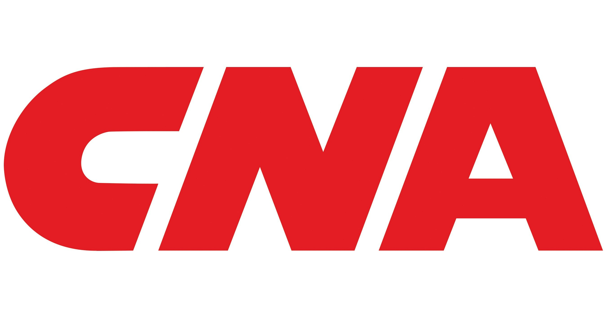
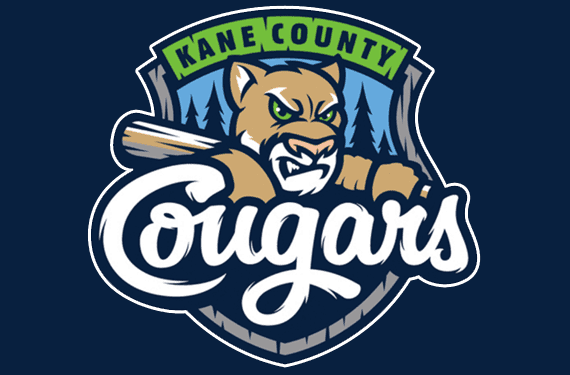

```{r echo = FALSE, eval = FALSE}
Cougars
Kyle Mzz
Amy bzzromann
Doug Czzzurylo
Lance Bzzuhmann

Irwin
Alex Fzzrawley
2 grad aszzsistants that I dont remember
Cassie Rzzynott

Compass Mzzortgage
Justin Vzzenhousen
Tom Szzimmons

CDW
Jeff Pzzartyka
Vic Ozzmiecinski
Ben Gzzabrek

CNA
Sasha Cozzzzzuc
Melanieeeee Martinnnn
Jasonssss Snyderrrrrr
```


<style>
.class1 {
	  color: #BFBFBF;
}
.new {
	  font-family: Times New Roman;
	  font-size: 18px;
}

code {
  color: #BLACK;
}

.imgheight {
  height: 150px;
}

@media only screen and (min-width: 925px) {
    .test222 {
      /*color:red;*/
      float: right;
      /*color: green;*/
    }
    .br-mobile-break {
        display: none;
    }
    .hr-hidden {
        height:10px;
        visibility: hidden;
      }
}
		  
</style>

```{r echo = FALSE, warning = FALSE, message = FALSE}
Update_Date = as.Date("01-01-2026", format = "%m-%d-%Y")
#Update_Date

library(dplyr)
library(gghighlight)
library(ggplot2)
library(googlesheets4)
library(kableExtra)
library(knitr)
library(lubridate)
library(rlang)
library(scales)
library(shiny)
library(shinydashboard)
library(stringr)
library(tidyverse)
```


<h1>Work Experience</h1>

<p class="last-updated">
Last updated: `r paste(format(x = Update_Date, format = "%B"), " ", format(x = Update_Date, format = "%d") %>% as.numeric(), ", ", format(x = Update_Date, format = "%Y") %>% as.numeric(), sep = "")`
</p>

<hr />


## CNA Financial Corporation

<p></p>
<center>

<p></p>
</center>

<h3>
<span>CNA Financial Corporation</span>
<br class="br-mobile-break">
<span class="test222">Chicago, IL</span>
</h3>


<h4>
<span>Senior Data Management Analyst</span>
<br class="br-mobile-break">
<span class="test222">July 2025 - Present</span>
</h4>

<ul class="new">

  <li>Collaborate with leaders and business partners to understand analytical requirements, identify appropriate data sources, and deliver information that supports the expected outcomes.</li>
  <li>Heavily leverage BigQuery SQL to create or adapt data models that are enabled and regularly updated in a cloud environment.</li>
  <li>Employ a standard production deployment process for created datasets to Google BigQuery and Power BI online, ensuring communication with stakeholders throughout the process.</li>
  <li>Support and enhance data processes by building out controls, validating, and adding capability to common datasets while ensuring reliability and data integrity.</li>
  <li>Identify requirements and subsequently build dashboards/exhibits for our stakeholders using Power BI, while ensuring the underlying SQL-based data is correct and up to date throughout the process.</li>
</ul>

<hr />


## CDW

<p></p>
<center>

<p></p>
</center>

<h3>
<span>Make Amazing Happen</span>
<br class="br-mobile-break">
<span class="test222">Chicago, IL</span>
</h3>

<h4>
<span>Senior Data Analyst - Product and Partner Management</span>
<br class="br-mobile-break">
<span class="test222">August 2021 - July 2025</span>
</h4>

<ul class="new">
  <li>Promoted to Senior Data Analyst (Oct 2023) for leading high-impact cross-functional initiatives and mentoring junior analysts.</li>
  <li>Developed executive-level performance reports for VPs and shareholders, enabling data-driven strategic decisions.</li>
  <li>Led SQL-based data migration to AWS cloud, cutting query processing times by 20% and improving scalability.</li>
  <li>Built Power BI forecasting models across four product categories, increasing budget accuracy by 10%.</li>
  <li>Designed market share analysis reports, uncovering expansion opportunities and driving entries into new markets.</li>
</ul>


<h4>
<span>Data Analyst - Product and Partner Management</span>
<br class="br-mobile-break">
<!--<span class="test222">August 2021 - October 2023</span>-->
</h4>

<ul class="new">
  <li>Converted partner finance dashboards from Excel to Power BI, saving 10 hours/week through automation and improved usability.</li>
  <li>Mentored 6+ new analysts, enhancing onboarding efficiency and contributing to overall team productivit.y</li>
  <li>Built attach-based analytics reports, uncovering transaction trends that led to a 12% increase in orders.</li>
  <li>Designed actionable reporting tools to improve data quality, monitor open orders, and strengthen partner compliance management.</li>

</ul>

<hr />


## Compass Mortgage

<p></p>
<center>

<p></p>
</center>

<h3>
<span>Home to a Better Mortgage Experience</span>
<br class="br-mobile-break">
<span class="test222">Warrenville, IL</span>
</h3>
<h4>
<span>Data Analyst</span>
<br class="br-mobile-break">
<span class="test222">June 2019 - August 2021</span>
</h4>

<ul class="new">
  <li>Managed data organization, the design and implementation of data, and overall development of SQL database.</li>
  <li>Wrote and executed SQL queries to provide custom Sisense reports and analysis for senior management.</li>
  <li>Optimized Salesforce CRM data structures, improving sync efficiency by 20%.</li>
  <li>Earned 3 awards for statistical analysis and performance (2019-2021).</li>
</ul>

<hr />


## Kane County Cougars Baseball Organization

<center>
 
<p></p>
</center>

<h3>
<span>Class-A Affilate of MLB Arizona Diamondbacks</span>
<br class="br-mobile-break">
<span class="test222">Geneva, IL</span>
</h3>
<h4>
<span>Accounting Intern</span>
<br class="br-mobile-break">
<span class="test222">Summer 2018</span>
</h4>

<ul class="new">
  <li>Accounting Intern for 2018 MILB Season</li>
  <li>Produced daily compilation of data generated by online ticket sales system.</li>
  <li>Generated reports to facilitate the reconciliation of sales data to cash receipts report by credit card companies, including PayPal.</li>
  <li>Aided overseeing of nearly $25,000 of physical cash flow per game, accounted for the transaction of the assets, and then reconciled bank accounts for those sales of assets.</li>
</ul>
<h4>
<span>Promotions Intern</span>
<br class="br-mobile-break">
<span class="test222">Summer 2017</span>
</h4>

<ul class="new">
  <li>Promotions Intern for 2017 MILB Season</li>
  <li>Led pre- and post-game fan engagement activities, enhancing the overall game day experience for audiences of all ages.</li>
  <li>Coordinated interactive promotions on the concourse and field, engaging with 100+ fans per game to boost participation and team spirit.</li>
  <li>Assisted in planning and executing themed game nights, giveaways, and sponsor activities to drive attendance and fan excitement.</li>
  <li>Collaborated with marketing and operations teams to ensure seamless execution of all promotional activities and fan experiences.</li>
  <li>Managed setup and breakdown of promotional materials and signage, ensuring branding consistency throughout the ballpark.</li>
</ul>

<hr />


## Irwin Academic Services Center

<center>

<p></p>
</center>

<h3>
<span>University of Illinois at Urbana-Champaign</span>
<br class="br-mobile-break">
<span class="test222">Champaign, IL</span>
</h3>
<h4>
<span>Student-Athlete Tutor</span>
<br class="br-mobile-break">
<span class="test222">August 2017 - May 2019</span>
</h4>

<ul class="new">
  <li>Met on a weekly basis with student-athletes to review class material of mathematics / statistics courses and ensured thorough knowledge of course subjects</li>
  <li>Guided student-athletes through their coursework, set goals for skill-development, and monitored their academic progress</li>
  <li>Developed learning strategies and action plans to overcome learning barriers and foster success</li>
</ul>


