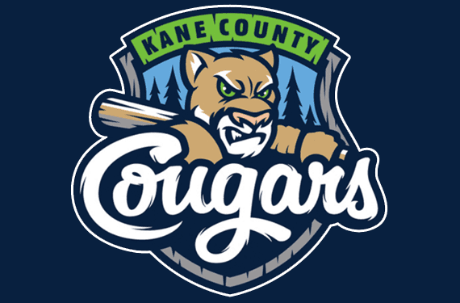

```{r echo = FALSE, eval = FALSE}
Cougars
Kyle Mzz
Amy bzzromann
Doug Czzzurylo
Lance Bzzuhmann


Irwin
Alex Fzzrawley
2 grad aszzsistants taht I dont remember
Cassie Rzzynott


Compass Mzzortgage
Justin Vzzenhousen
Tom Szzimmons

CDW
Jeff Pzzartyka
Vic Ozzmiecinski
Ben Gzzabrek
```


<style>
.class1 {
	  color: #BFBFBF;
}
.new {
	  font-family: Times New Roman;
	  font-size: 18px;
}

code {
  color: #BLACK;
}

</style>

```{r echo = FALSE, warning = FALSE, message = FALSE}
Update_Date = as.Date("11-01-2023", format = "%m-%d-%Y")
#Update_Date

library(tidyverse)
```


<h1>Work Experience</h1>

<p class="last-updated">
Last updated: `r paste(format(x = Update_Date, format = "%B"), " ", format(x = Update_Date, format = "%d") %>% as.numeric(), ", ", format(x = Update_Date, format = "%Y") %>% as.numeric(), sep = "")`
</p>

<hr />


## CDW

<p></p>
<center> <!--image -->

<p></p>
</center>

<h3>
<!--<span>People Who Get IT</span>Removing 10/2/2023-->
<span>Make Amazing Happen</span>
<br class="br-mobile-break">
<span class="test222">Chicago, IL</span>
</h3>


<h4>
<span>Senior Data Analyst - Product and Partner Management</span>
<br class="br-mobile-break">
<span class="test222">November 2023 - Present</span>
</h4>

<ul class="new">

  <li>Managed CDW Client reporting and analytics that were presented to VP and shareholders on a weekly basis</li>
  <li>Coordinated data migration from on-premise database to new cloud environment</li>
  <li>Forecasted quarterly projections in Power BI for several product categories using historical weekly trends and pending transactions</li>
  <li>Designed market share analysis report to indicate opportunities for expansions in developed and developing markets</li>

</ul>


<h4>
<span>Data Analyst - Product and Partner Management</span>
<br class="br-mobile-break">
<span class="test222">August 2021 - November 2023</span>
</h4>

<ul class="new">

  <li>Managed partner finance reporting, transitioning dashboards from Excel to self-service BI</li>
  <li>Selected as team mentor through outstanding leadership to train and onboard new employees</li>
  <li>Created attach-based reporting to identify trends of correlated transactions to increase orders</li>
  <li>Designed actionable reporting tools that supported effective management of data quality, open orders, and other partner compliance topics</li>

</ul>

<!--
[CDW Website](https://www.cdw.com/){target="_blank"}
-->


<hr />

## Compass Mortgage

<p></p>
<center>
<!--


!-->

<p></p>
</center>

<h3>
<span>Home to a Better Mortgage Experience</span>
<br class="br-mobile-break">
<span class="test222">Warrenville, IL</span>
</h3>
<h4>
<span>Data Analyst</span>
<br class="br-mobile-break">
<span class="test222">June 2019 - August 2021</span>
</h4>

<ul class="new">
  <!-- <li>Responsible for managing data organization, the design and implementation of data, and overall development of SQL database</li>
  <li>Wrote and executed SQL queries to provide custom reports and analysis for senior management</li>
  <li>Clean, transform, and model data to ensure and improve accuracy of metrics calculations</li>
  <li>Develop, maintain and perform processes to continuously monitor data quality and integrity in platform applications</li>
  <li>Analyze and interpret data to identify trends, patterns, and opportunities for the business</li>
  <li>Managed Salesforce CRM data structures and synchronization of custom objects</li> 
  <li>Manage data by creating, updating, and organizing data</li>
  <li>Design and implement data structures and user interfaces</li>
  <li>Develop databases using data access languages</li>
  <li>Develop data schemas to support information delivery and consumption</li>
  <li>Prepare reports and analysis</li>
  <li>Troubleshoot the reporting database</li>
  <li>Train end users on new reports and/or dashboards</li>
  <li>Create and iterate on deliverables</li> -->
  
 <!-- resume as of 7/31/2021
  <li>Responsible for managing data organization, the design and implementation of data, and overall development of SQL database</li>
  <li>Write and execute SQL queries to provide custom reports and analysis for senior management</li>
  <li>Design analysis and development of data architectures for SQL relational database</li>
  <li>Clean, transform, and model data to ensure and improve accuracy of metrics calculations</li>
  <li>Develop, maintain and perform processes to continuously monitor data quality and integrity in platform
applications</li>
  <li>Analyze and interpret data to identify trends, patterns, and opportunities for the business</li>
  <li>Manage Salesforce CRM data structures and synchronization of custom objects</li>
  <li>Received 3 moments of recognition for outstanding achievement of statistical analysis and overall employee
performance: November 2019, January 2020, March 2021</li> -->

  <li>Managed data organization, the design and implementation of data, and overall development of SQL database</li>
  <li>Wrote and executed SQL queries to provide custom Sisense reports and analysis for senior management</li>
  <li>Designed analysis and development of data architectures for SQL relational database</li>
  <li>Cleaned, transformed, and modeled data to ensure and improve accuracy of metrics calculations</li>
  <li>Developed, maintained, and performed processes to continuously monitor data quality and integrity in platform applications</li>
  <li>Analyzed and interpreted data to identify trends, patterns, and opportunities for the business</li>
  <li>Managed Salesforce CRM data structures and synchronization of custom objects</li>
  <li>Received 3 moments of recognition for outstanding achievement of statistical analysis and overall employee performance: November 2019, January 2020, March 2021</li>

</ul>

<!--
[Compass Mortgage Website](https://www.compmort.com){target="_blank"}
-->

<hr />


## Kane County Cougars

```{r out.height = "150px", out.width = "200px", fig.align = "center", echo = FALSE}
# library(knitr)
# 
# since both lines are commented out, this technically could be deleted
```

<center>
   
<p></p>
</center>

<h3>
<span>Class-A Affilate of MLB Arizona Diamondbacks</span>
<br class="br-mobile-break">
<span class="test222">Geneva, IL</span>
</h3>
<h4>
<span>Accounting Intern</span>
<br class="br-mobile-break">
<span class="test222">Summer 2018</span>
</h4>

<ul class="new">
  <li>Accounting Intern for 2018 MILB Season</li>
  <li>Produced daily compilation of data generated by online ticket sales system</li>
  <li>Generated reports to facilitate the reconciliation of sales data to cash receipts report by credit card companies, including PayPal</li>
  <li>Compiled data into spreadsheets regarding the cash flow from previous years in comparison to the current year</li>
  <li>Processed group outing orders by reconciling billing discrepancies between group sales personnel and a third-party food service operator</li>
  <li>Aided overseeing of nearly $25,000 of physical cash flow per game, accounted for the transaction of the assets, and then reconciled bank accounts for those sales of assets</li>
</ul>

<!--
[Kane County Cougars Website](https://www.milb.com/kane-county){target="_blank"}
-->

<hr />


## Irwin Academic Services Center

```{r out.height = "150px", out.width = "200px", fig.align = "center", echo = FALSE}
# library(knitr)
# include_graphics("images/irwin.jpg")
```

<center>

<p></p>
</center>

<h3>
<span>University of Illinois at Urbana-Champaign</span>
<br class="br-mobile-break">
<span class="test222">Champaign, IL</span>
</h3>
<h4>
<span>Student-Athlete Tutor</span>
<br class="br-mobile-break">
<span class="test222">August 2017 - May 2019</span>
</h4>

<ul class="new">
  <li>Met on a weekly basis with student-athletes to review class material of mathematics / statistics courses and ensured thorough knowledge of course subjects</li>
  <li>Guided student-athletes through their coursework, set goals for skill-development, and monitored their academic progress</li>
  <li>Developed learning strategies and action plans to overcome learning barriers and foster success</li>
</ul>


