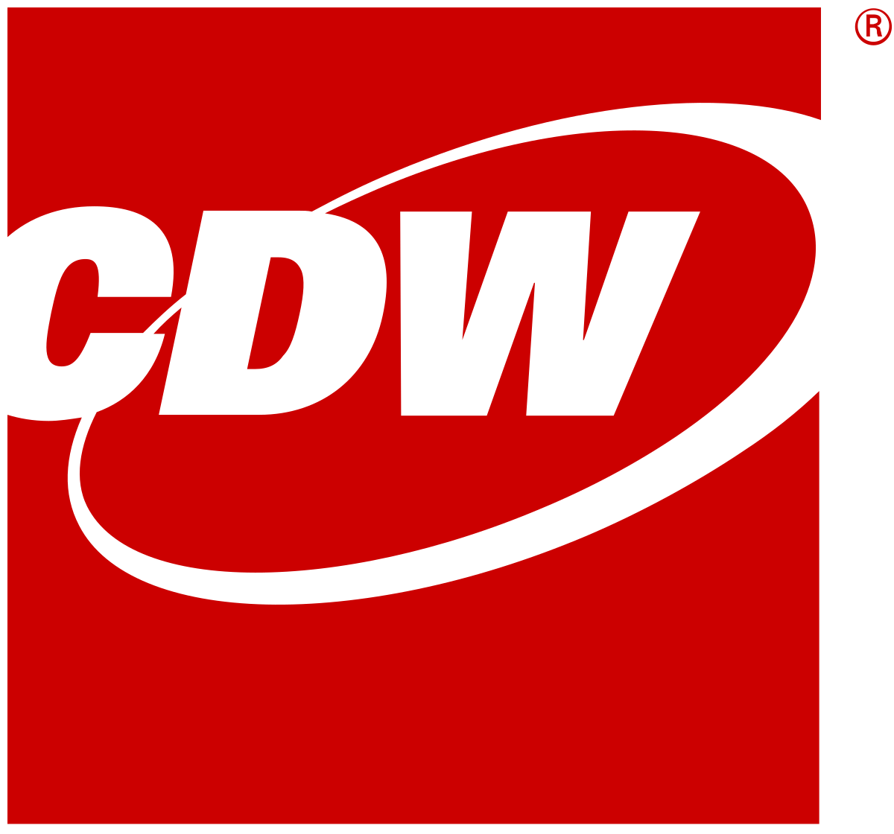

```{r echo = FALSE, warning = FALSE, message = FALSE}
Update_Date = as.Date("04/01/2022", format = "%m/%d/%Y")
library(tidyverse)
```

<h1>Work Experience</h1>

Last updated: `r paste(format(x = Update_Date, format = "%B"), " ", format(x = Update_Date, format = "%d") %>% as.numeric(), ", ", format(x = Update_Date, format = "%Y") %>% as.numeric(), sep = "")`

<hr />

## CDW Corporation

<p></p>
<center>

<p></p>
</center>

<h3 style="text-align:left;">
People Who Get IT <!-- PEOPLE WHO GET IT -->
<span style="float:right;">
<!--
<i class="fa fa-map-marker" style="font-size:24px"></i>
-->
Lincolnshire, IL
</span>
</h3>

<h4 style="text-align:left;">
Data Analyst
<span style="float:right;">August 2021 - Present</span>
</h4>

<ul>

<li>Serve as a conduit/broker for cross-functional collaboration and knowledge sharing</li>
<li>Design actionable reporting tools that support effective management of data quality, open orders and other partner compliance topics</li>
<li>Produce sound analysis in support of Product and Partner Management decision makers to drive tactical and strategic departmental objectives and partnership decisions</li>
<li>Develop and manage centralized partner and product reporting to support various functions including purchasing, promotions, marketing and partner relations. Coordinate and guide stakeholders through a process of creating reports and data models that successfully address business issues. Provide ongoing support for these reports</li>

</ul>

<!--
[CDW Website](https://www.cdw.com/){target="_blank"}
-->

<hr />

## Compass Mortgage

<p></p>
<center>

<p></p>
</center>

<h3 style="text-align:left;">
Home to a Better Mortgage Experience
<span style="float:right;">
<!--
<i class="fa fa-map-marker" style="font-size:24px"></i>
-->
Warrenville, IL
</span>
</h3>

<h4 style="text-align:left;">
Data Analyst
<span style="float:right;">June 2019 - August 2021</span>
</h4>

<ul>
<!--
  <li>Responsible for managing data organization, the design and implementation of data, and overall development of SQL database</li>
  <li>Wrote and executed SQL queries to provide custom reports and analysis for senior management</li>
  <li>Clean, transform, and model data to ensure and improve accuracy of metrics calculations</li>
  <li>Develop, maintain and perform processes to continuously monitor data quality and integrity in platform applications</li>
  <li>Analyze and interpret data to identify trends, patterns, and opportunities for the business</li>
  <li>Managed Salesforce CRM data structures and synchronization of custom objects --!>
  <!-- <li>Manage data by creating, updating, and organizing data</li> -->
  <!-- <li>Design and implement data structures and user interfaces</li> -->
  <!-- <li>Develop databases using data access languages</li> -->
  <!-- <li>Develop data schemas to support information delivery and consumption</li> -->
  <!-- <li>Prepare reports and analysis</li> -->
  <!-- <li>Troubleshoot the reporting database</li> -->
  <!-- <li>Train end users on new reports and/or dashboards</li> -->
  <!-- <li>Create and iterate on deliverables</li> -->
  
 <!-- resume as of 7/31/2021
  <li>Responsible for managing data organization, the design and implementation of data, and overall development of SQL database</li>
  <li>Write and execute SQL queries to provide custom reports and analysis for senior management</li>
  <li>Design analysis and development of data architectures for SQL relational database</li>
  <li>Clean, transform, and model data to ensure and improve accuracy of metrics calculations</li>
  <li>Develop, maintain and perform processes to continuously monitor data quality and integrity in platform
applications</li>
  <li>Analyze and interpret data to identify trends, patterns, and opportunities for the business</li>
  <li>Manage Salesforce CRM data structures and synchronization of custom objects</li>
  <li>Received 3 moments of recognition for outstanding achievement of statistical analysis and overall employee
performance: November 2019, January 2020, March 2021</li> -->

  <li>Managed data organization, the design and implementation of data, and overall development of SQL database</li>
  <li>Wrote and executed SQL queries to provide custom Sisense reports and analysis for senior management</li>
  <li>Designed analysis and development of data architectures for SQL relational database</li>
  <li>Cleaned, transformed, and modeled data to ensure and improve accuracy of metrics calculations</li>
  <li>Developed, maintained, and performed processes to continuously monitor data quality and integrity in platform applications</li>
  <li>Analyzed and interpreted data to identify trends, patterns, and opportunities for the business</li>
  <li>Managed Salesforce CRM data structures and synchronization of custom objects</li>
  <li>Received 3 moments of recognition for outstanding achievement of statistical analysis and overall employee performance: November 2019, January 2020, March 2021</li>

</ul>

<!--
[Compass Mortgage Website](https://www.compmort.com){target="_blank"}
-->

<hr />

## Kane County Cougars

```{r out.height = "150px", out.width = "200px", fig.align = "center", echo = FALSE}
# library(knitr)
# include_graphics("images/cougarslogo.png")
```


<center>
   
<p></p>
</center>

<h3 style="text-align:left;">
Class-A Affilate of MLB Arizona Diamondbacks
<span style="float:right;">
<!--
<i class="fa fa-map-marker" style="font-size:24px"></i>
-->
Geneva, IL</span>
</h3>

<h4 style="text-align:left;">
Accounting Intern
<span style="float:right;">Summer 2018</span>
</h4>

<ul>
  <li>Accounting Intern for 2018 MILB Season</li>
  <li>Produced daily compilation of data generated by online ticket sales system</li>
  <li>Generated reports to facilitate the reconciliation of sales data to cash receipts report by credit card companies, including PayPal</li>
  <li>Compiled data into spreadsheets regarding the cash flow from previous years in comparison to the current year</li>
  <li>Processed group outing orders by reconciling billing discrepancies between group sales personnel and a third-party food service operator</li>
  <li>Aided overseeing of nearly $25,000 of physical cash flow per game, accounted for the transaction of the assets, and then reconciled bank accounts for those sales of assets</li>
</ul>

<!--
[Kane County Cougars Website](https://www.milb.com/kane-county){target="_blank"}
-->

<hr />

## Irwin Academic Services Center

```{r out.height = "150px", out.width = "200px", fig.align = "center", echo = FALSE}
# library(knitr)
# include_graphics("images/irwin.jpg")
```

<center>

<p></p>
</center>

<h3 style="text-align:left;">
University of Illinois at Urbana-Champaign
<span style="float:right;">
<!--
<i class="fa fa-map-marker" style="font-size:24px"></i>
-->
Champaign, IL
</span>
</h3>

<h4 style="text-align:left;">
Mathematics / Statistics Tutor
<span style="float:right;">August 2017 - May 2019</span>
</h4>

<ul>
  <li>Met on a weekly basis with student-athletes to review class material of mathematics / statistics courses and ensured thorough knowledge of course subjects</li>
  <li>Guided student-athletes through their coursework, set goals for skill-development, and monitored their academic progress</li>
  <li>Developed learning strategies and action plans to overcome learning barriers and foster success</li>
</ul>

